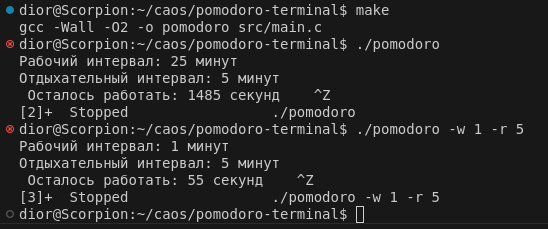

## Отчёт на 15 декабря

**Что сделано:**
- Создан репозиторий с проектом таймера Помодоро.
- Добавлен `main.c`, который парсит аргументы командной строки `-w` и `-r` и отсчитывает рабочие и отдыхательные интервалы. Default: -w 25 -r 5.
- Реализован основной таймер: он действительно «тикает», отображает оставшееся время и подаёт звуковой сигнал по окончании.
- Ведётся статистика: при завершении рабочего интервала в `stats.txt` увеличивается счётчик. Командой `./pomodoro stats` можно посмотреть, сколько циклов уже пройдено.
- Подготовлен `Makefile`, позволяющий легко собрать проект, и обновлён `README.md` с инструкциями по запуску.

**Что не сделано:**
- Команды `pause` и `reset` пока не реализованы.
- Ассемблер для более навороченных уведомлений ещё не подключался (пока есть только стандартный звуковой сигнал `\a`).

**Что планируется:**
- Добавить возможность приостановки и сброса таймера.
- При наличии времени — расширить функциональность уведомлений.

**Сейчас проект можно:**
- Собрать с помощью `make`.
- Запустить `./pomodoro -w <минуты> -r <минуты>` и увидеть, как отсчитывается время. Default: -w 25 -r 5.
- Посмотреть статистику через `./pomodoro stats`.

**Пример использования:**
- 

В общем таймер уже работает, меняет интервалы по аргументам, сигналит и считает продуктивность.
